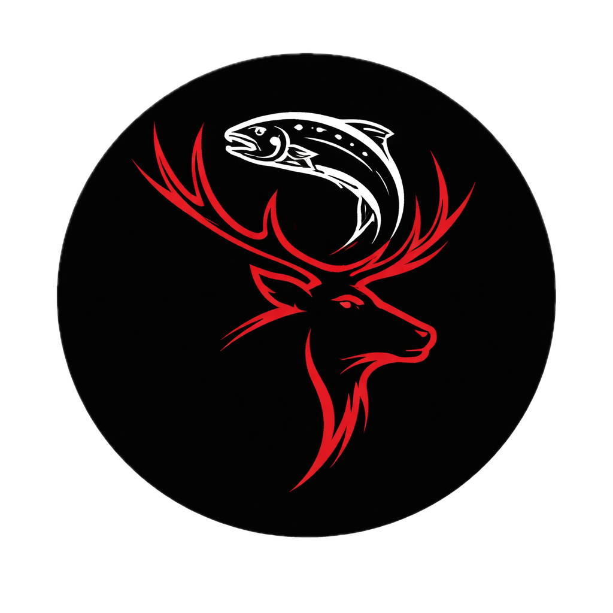

    

# Wild Logic Lab

Wild Logic Lab is an application that integrates outdoor data from Alberta with machine learning to help anglers and hunters understand the trade-off between effort and success when planning trips across different WMUs.

This tool is designed as an educational platform, aimed at empowering hunters and anglers to leverage modern data-driven techniques to interpret publicly available government data and make more informed decisions in the field—ultimately increasing their chances of success on every outing.

